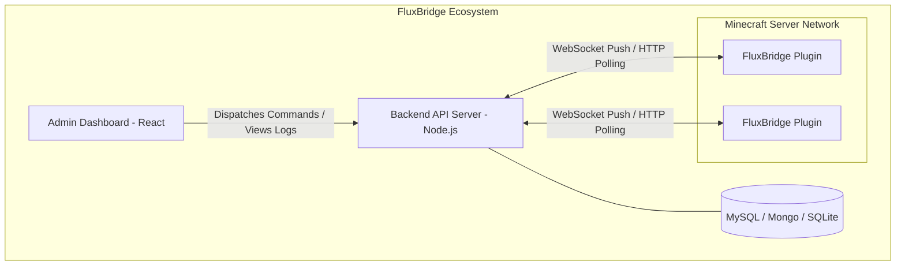

<div align="center">
  <h1>🌉 FluxBridge</h1>
  <p><strong>A Production-Ready, Dual-Mode Minecraft Store Relay Platform</strong></p>
  <p>
    
    
    
  </p>
</div>

<hr />

## 📖 Overview

**FluxBridge** is a highly scalable relay system designed to deliver commands from a central web platform to multiple Minecraft servers in real-time or via HTTP polling. It features an intelligent **Dual-Mode Architecture** and an **Offline Queueing System** that guarantees delivery. 

It is structured into three connected components:
1. **[Backend API Server](./backend/README.md)** (Node.js/Express/WS)
2. **[Frontend Admin Dashboard](./frontend/README.md)** (React/Vite/Tailwind)
3. **[Minecraft Plugin](./plugin/README.md)** (Java/Paper API)

---

## ⚡ Key Features

- **Dual-Mode Hybrid Networking:** Supports pure real-time WebSocket push mechanics (`wss://`), seamlessly falling back to HTTP Long-Polling (`/api/commands`) if the WebSocket is disconnected.
- **Offline Delivery Queue:** If a command requires the player to be online but they aren't, the plugin automatically saves the command to a persistent local `queue.yml` and executes it immediately upon the player's next login.
- **Database Agnostic Backend:** The Node.js backend ships with abstracted `knex` and `mongoose` integration, allowing you to easily swap between `MySQL`, `PostgreSQL`, `SQLite`, or `MongoDB`.
- **Admin Real-Time Tracking:** The React Dashboard provides complete visibility over server heartbeats and tracks the entire lifecycle of a command (`PENDING` -> `QUEUED` -> `SUCCESS` | `FAILED`).
- **Fully Automated CI/CD:** Built-in `.github/workflows` to test, compile, and automatically release `.jar` binaries upon pushing new tags.

---

## 🏗 System Architecture



---

## 🚀 Quick Start Guide

### 1. Run the Backend
Configure your `.env` to point to your desired database (defaults to local MySQL or SQLite), then start the server.
```bash
cd backend
npm install
npm run start
```
*The backend API runs on port 3000.*

### 2. Run the Dashboard
Power up the React Vite server to access the GUI.
```bash
cd frontend
npm install
npm run dev
```
*Access the dashboard at `http://localhost:5173`.*

### 3. Deploy the Plugin
Take the pre-compiled `.jar` from the latest [GitHub Release](../../releases), or compile it yourself. Upload it to your `plugins/` folder. Use the **Admin Dashboard** to generate a `Server` entity, then paste the credentials into the plugin's `config.yml`.
```bash
cd plugin
mvn clean package
```

---

## ☁️ CI/CD & Automation

This repository includes a robust GitHub Actions workflow located in `.github/workflows/ci-cd.yml`. 
- **Tests**: On every Pull Request or Commit to `main`, the pipeline verifies the backend Node syntax, builds the React frontend, and verifies maven compilation for the Java Plugin.
- **Releases**: Pushing a tag formatted as `vX.X.X` triggers the **Auto-Release** job. It generates the final production JAR, compiles release notes, and attaches the binary to a clean GitHub Release page automatically.

---
*Built with ❤️ for Minecraft Server Store Networks.*
